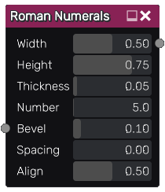
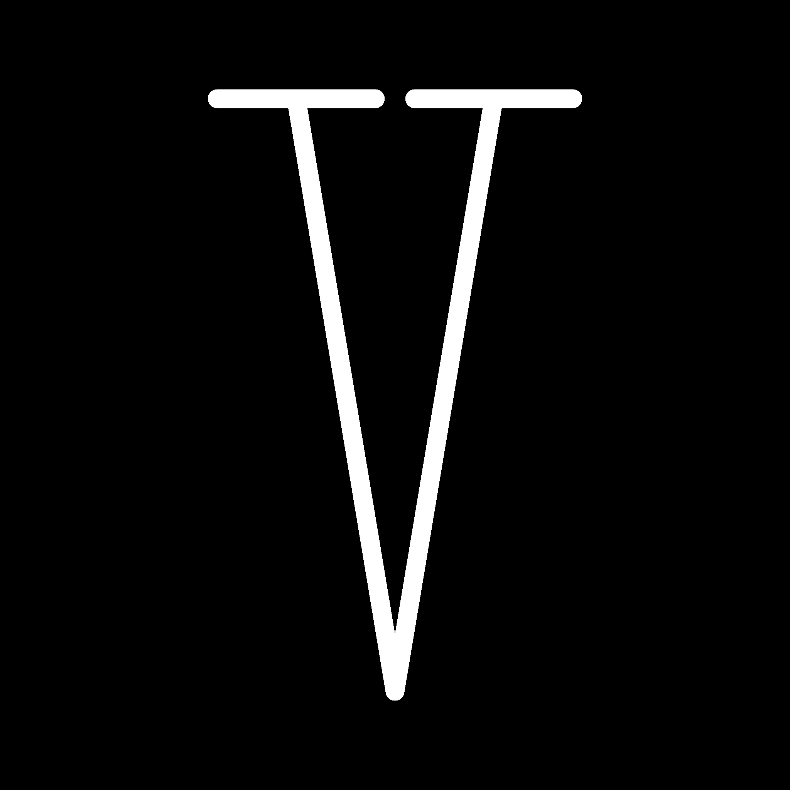

Roman numerals node
~~~~~~~~~~~~~~~~~~~

The **Roman numerals** node outputs roman numbers up to 3999

Inputs
++++++

The **Roman numerals** node accepts an optional bevel map, which the parameter is multiplied by the map value.

Outputs
+++++++

The **Roman numerals** node outputs a grayscale texture.

Parameters
++++++++++

The **Roman numerals** node accepts the following parameters:

* The *Width* parameter controls the width of the glyphs.

* The *Height* parameter controls the height of the glyphs.

* The *Thickness* parameter controls the thickness of the glyphs.

* The *Number* parameter specifies the roman number to generate.

* the *Bevel* parameter controls the glyph's edge widths.

* the *Spacing* parameter controls the spacing between glyphs.

* the *Align* parameter controls how the number is aligned (0: left, 0.5: center, 1: right).

Example images
++++++++++++++

