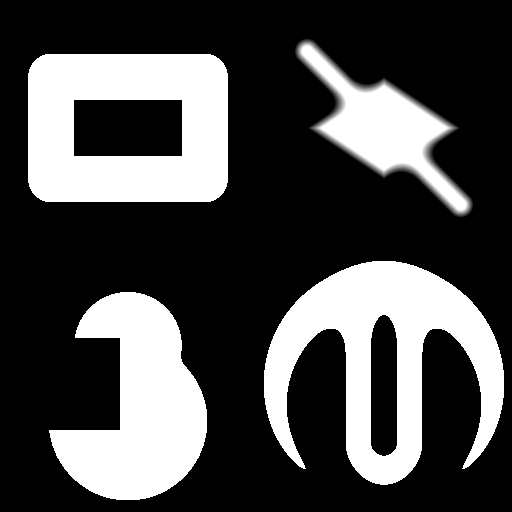

2D Signed distance function geometry nodes
~~~~~~~~~~~~~~~~~~~~~~~~~~~~~~~~~~~~~~~~~~

The signed distance function nodes can be used to define complex geometry using simple
shapes.

They are based on a very small set of basic shapes, that can be combined using operators,
and finally output as a greyscale image using the **sdShow** node.

All output samples shown in this section are images generated through the **sdShow** node.

All Signed Distance Functions nodes are based on code written by Inigo Quilez that can be found
`on this page`__.

.. _sdf2dpage: https://www.iquilezles.org/www/articles/distfunctions2d/distfunctions2d.htm

__ sdf2dpage_

.. toctree::
	:maxdepth: 1

	node_simple_sdf_operators_sdshow

Shapes
++++++

.. toctree::
	:maxdepth: 1

	node_simple_sdf_shapes_sdcircle
	node_simple_sdf_shapes_sdline
	node_simple_sdf_shapes_sdbox
	node_simple_sdf_shapes_sdrhombus
	node_simple_sdf_shapes_sdarc
	node_simple_sdf_shapes_sdpolygon

Operators
+++++++++

.. toctree::
	:maxdepth: 1

	node_simple_sdf_operators_sdboolean
	node_simple_sdf_operators_sdsmoothboolean
	node_simple_sdf_operators_sdroundedshape
	node_simple_sdf_operators_sdannularshape
	node_simple_sdf_operators_sdmorph
	node_simple_sdf_operators_sdrepeat
	node_simple_sdf_operators_sdcirclerepeat

Transforms
++++++++++

.. toctree::
	:maxdepth: 1

	node_simple_sdf_transforms_translate
	node_simple_sdf_transforms_rotate
	node_simple_sdf_transforms_scale

Example images
++++++++++++++

