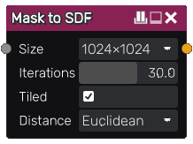

Mask to SDF node
................

The **Mask to SDF** node generates a signed distance image from an image mask.

Inputs
::::::

The **Mask to SDF** node accepts a greyscale image input.

Outputs
:::::::

The **Mask to SDF** node generates a signed distance function of the
greyscale input mask.

Parameters
::::::::::

The **Size** used for the image operation to convert the mask into the distance field.

The number of **Iterations** used in the jump flood operation to calculate the distance field.

Whether the distance field is **Tiled**.

The **Distance** function used to calculate the distance field.

Example images
::::::::::::::

