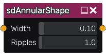

sdAnnularShape node
...................

The **sdAnnularShape** node generates a signed distance image of an annular shape
based on its input, by substracting a constant from the absolute value of the
distance function (i.e. creating a ring around the shape).

Inputs
::::::

The **sdAnnularShape** node accepts an input in signed distance function format.

Outputs
:::::::

The **sdAnnularShape** node generates a signed distance function of the
annular version of the input shape.

Parameters
::::::::::

The **sdAnnularShape** node accepts the following parameters:

* *the distance* to be substracted from the absolute value of the
  function (i.e. half the width of the ring)

Example images
::::::::::::::

