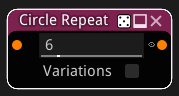
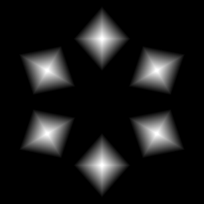

sdCircleRepeat node
...................

The **sdCircleRepeat** node generates a signed distance image obtained by repeating
the input on a circle.

Inputs
::::::

The **sdCircleRepeat** node accepts a single input in signed distance function format.

Outputs
:::::::

The **sdCircleRepeat** node generates a signed distance function of the
repeated pattern.

Parameters
::::::::::

The **sdCircleRepeat** node accepts the following parameters:

* The **Count** controls the number of repetitions of the input.
* The **Variations** control enables variation sampling on the input

Example images
::::::::::::::

