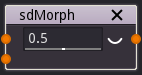
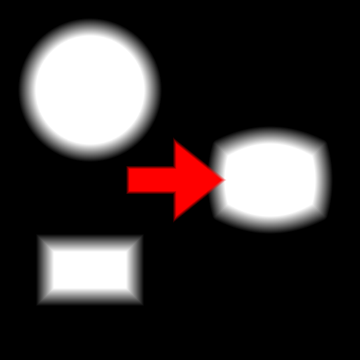

sdMorph node
............

The **sdMorph** node generates a signed distance image obtained by mixing two input
2D signed distance functions.

Inputs
::::::

The **sdMorph** node accepts 2 inputs in signed distance function format.

Outputs
:::::::

The **sdMorph** node generates a signed distance function of the
combination of its inputs.

Parameters
::::::::::

The **sdMorph** node accepts accepts *the mix factor* as parameter.

Example images
::::::::::::::

