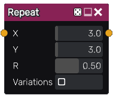

sdRepeat node
.............

The **sdRepeat** node generates a signed distance image obtained by repeating
the input on a grid.

Inputs
::::::

The **sdRepeat** node accepts a single input in signed distance function format.

Outputs
:::::::

The **sdRepeat** node generates a signed distance function of the
repeated pattern.

Parameters
::::::::::

The **sdRepeat** node accepts accepts *the number of lines and columns*
of the repeat grid, as well as the *rotation randomness* as parameters.

Example images
::::::::::::::

