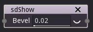

sdShow node
...........

The **sdShow** node converts a signed distance image into a greyscale
image whose background is black and the shape described by its input
is white.

Inputs
::::::

The **sdShow** node accepts an input in signed distance function format.

Outputs
:::::::

The **sdShow** node generates a greyscale output.

Parameters
::::::::::

The **sdShow** node accepts the *width of the gradient* (from white to black)
around the input shape as parameter.
