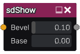

sdShow node
...........

The **sdShow** and **sdShow 2** node convert a signed distance image into a greyscale
image whose background is black and the shape described by its input
is white.

The sdShow 2 node fixes the distance when it is distorted, and consequently generates
shapes with more consistent bevel width.

Inputs
::::::

The **sdShow** node accepts an input in signed distance function format.

Outputs
:::::::

The **sdShow** node generates a greyscale output.

Parameters
::::::::::

The **sdShow** node accepts the *width of the gradient* (from white to black)
around the input shape as well as the *base value of the output* as parameters.
