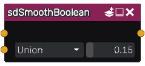

sdSmoothBoolean node
....................

The **sdSmoothBoolean** node generates a signed distance image for the combination (union,
intersection or difference) of its inputs.

Inputs
::::::

The **sdSmoothBoolean** node accepts two or more inputs in signed distance function format.

This node is variadic, and more shapes can be added.

Outputs
:::::::

The **sdSmoothBoolean** node generates a signed distance function of the
combination of its inputs.

Parameters
::::::::::

The **sdSmoothBoolean** node accepts the following parameters:

* *the operator it applies (union, intersection or difference)*
* *the smoothness* of the operation

Example images
::::::::::::::

.. image:: images/node_sdsmoothboolean_sample.png
	:align: center
