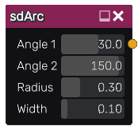

sdArc node
..........

The **sdArc** node generates a signed distance image for shape constructed
from an arc, by substracting its width from its distance function.

Inputs
::::::

The **sdArc** node does not accept any input.

Outputs
:::::::

The **sdArc** node generates a signed distance function for the shape it defines.

Parameters
::::::::::

The **sdArc** node accepts the following parameters:

* both *angles* and the *radius* of the arc
* the *width* of the rounded shape constructed from the arc

Example images
::::::::::::::

