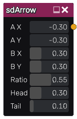

sdArrow node
............

The **sdArrow** node generates a signed distance image for an arrow.

Inputs
::::::

The **sdArrow** node does not accept any input.

Outputs
:::::::

The **sdArrow** node generates a signed distance function for an arrow.

Parameters
::::::::::

The **sdArrow** node accepts the following parameters:

* *X and Y coordinates of both ends of the arrow*.

* **Ratio** of the arrow head to tail.

* **Head** width of the arrow.

* **Tail** width of the arrow.

Example images
::::::::::::::

