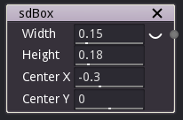
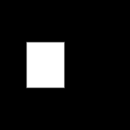

sdBox node
..........

The **sdBox** node generates a signed distance image for a rectangle.

Inputs
::::::

The **sdBox** node does not accept any input.

Outputs
:::::::

The **sdBox** node generates a signed distance function for an axis aligned box.

Parameters
::::::::::

The **sdBox** node accepts the following parameters:

* its *width* and *height*
* the *X and Y coordinates of opposite of its center*

Example images
::::::::::::::

