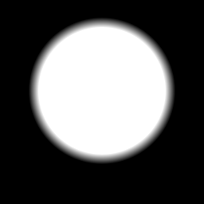

sdCircle node
.............

The **sdCircle** node generates a signed distance image for a circle.

.. image:: images/node_sdcircle.png
	:align: center

Inputs
::::::

The **sdCircle** node does not accept any input.

Outputs
:::::::

The **sdCircle** node generates a signed distance function for a circle.

Parameters
::::::::::

The **sdCircle** node accepts the following parameters:

* the *radius* of the circle
* the *X and Y coordinates of the center* of the circle

Example images
::::::::::::::

