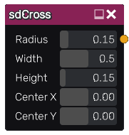

sdCross node
............

The **sdCross** node generates a signed distance image for a cross.

Inputs
::::::

The **sdCross** node does not accept any input.

Outputs
:::::::

The **sdCross** node generates a signed distance function for a cross.

Parameters
::::::::::

The **sdCross** node accepts the following parameters:

* **Radius** of the cross.

* **Width** of the cross.

* **Height** of the cross.

* Position of the center along X and Y axis.

Example images
::::::::::::::

