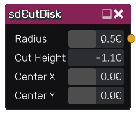

sdCutDisk node
..............

The **sdCutDisk** node generates a signed distance image for a disk clipped by a line.

Inputs
::::::

The **sdCutDisk** node does not accept any input.

Outputs
:::::::

The **sdCutDisk** node generates a signed distance function for a disk clipped by a line.

Parameters
::::::::::

The **sdCutDisk** node accepts the following parameters:

* **Radius** of the cut disk.

* **Cut Height** of the line on the disk.

* Position of the center along X and Y axis.

Example images
::::::::::::::

.. image:: images/node_sdcutdisk_sample.png
	:align: center
