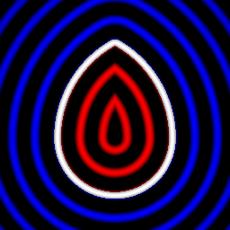

sdEgg node
..........

The **sdEgg** node generates a signed distance image for an egg.

.. image:: images/node_simple_sdf_shapes_sdegg.png
	:align: center

Inputs
::::::

The **sdEgg** node does not accept any input.

Outputs
:::::::

The **sdEgg** node generates a signed distance function for an egg.

Parameters
::::::::::

The **sdEgg** node accepts the following parameters:

* **Radius** of the egg.

* **Pointiness** of the tip of the egg.

* Position of the center along X and Y axis.

Example images
::::::::::::::

