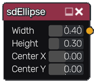
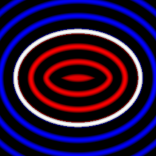

sdEllipse node
~~~~~~~~~~~~~~

The **sdEllipse** node generates a signed distance image for an ellipse.

Inputs
++++++

The **sdEllipse** node does not accept any input.

Outputs
+++++++

The **sdEllipse** node generates a signed distance function for an ellipse.

Parameters
++++++++++

The **sdEllipse** node accepts the following parameters:

* **Width** of the ellipse

* **Height** of the ellipse

* Position of the center along X and Y axis.

Example images
++++++++++++++

