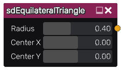

sdEquilateralTriangle node
..........................

The **sdEquilateralTriangle** node generates a signed distance image for an equilateral triangle.

Inputs
::::::

The **sdEquilateralTriangle** node does not accept any input.

Outputs
:::::::

The **sdEquilateralTriangle** node generates a signed distance function for an equilateral triangle.

Parameters
::::::::::

The **sdEquilateralTriangle** node accepts the following parameters:

* **Radius** of the equilateral triangle.

* position of the center along X and Y axis.

Example images
::::::::::::::

