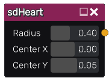

sdHeart node
............

The **sdHeart** node generates a signed distance image for a heart.

Inputs
::::::

The **sdHeart** node does not accept any input.

Outputs
:::::::

The **sdHeart** node generates a signed distance function for a heart.

Parameters
::::::::::

The **sdHeart** node accepts the following parameters:

* **Radius** of the heart.

* Position of the center along X and Y axis.

Example images
::::::::::::::

