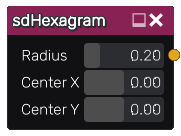

sdHexagram node
...............

The **sdHexagram** node generates a signed distance image for a hexagram.

Inputs
::::::

The **sdHexagram** node does not accept any input.

Outputs
:::::::

The **sdHexagram** node generates a signed distance function for a hexagram.

Parameters
::::::::::

The **sdHexagram** node accepts the following parameters:

* **Radius** of the hexagram.

* Position of the center along X and Y axis.

Example images
::::::::::::::

