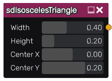

sdIsoscelesTriangle node
........................

The **sdIsoscelesTriangle** node generates a signed distance image for an isosceles triangle.

Inputs
::::::

The **sdIsoscelesTriangle** node does not accept any input.

Outputs
:::::::

The **sdIsoscelesTriangle** node generates a signed distance function for a isosceles triangle.

Parameters
::::::::::

The **sdIsoscelesTriangle** node accepts the following parameters:

* **Width** of the isosceles triangle.

* **Height** of the isosceles triangle.

* The position of the center along X and Y axis.

Example images
::::::::::::::

