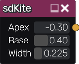
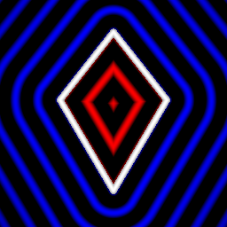

sdKite node
...........

The **sdKite** node generates a signed distance image for a kite.

Inputs
::::::

The **sdKite** node does not accept any input.

Outputs
:::::::

The **sdKite** node generates a signed distance function for a kite.

Parameters
::::::::::

The **sdKite** node accepts the following parameters:

* *Apex* position of the kite along the Y axis
* *Base* position of the kite along the Y axis
* *Width* of the kite

Example images
::::::::::::::

