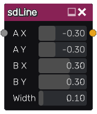

sdLine node
.............

The **sdLine** node generates a signed distance image for a line segment. It can
easily be turned into a capsule shape using an **sdRoundedShape** node (the result
is shown in the example image below).

Inputs
::::::

The **sdLine** node accepts an optional profile as input (use a Tonality node to create it).

Outputs
:::::::

The **sdLine** node generates a signed distance function for a line.

Parameters
::::::::::

The **sdLine** node accepts the *X and Y coordinates of both ends of the
segment* as parameters.

Example images
::::::::::::::

.. image:: images/node_sdline_sample.png
	:align: center
