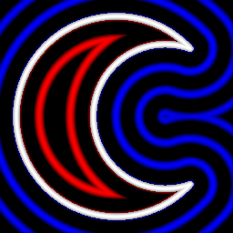

sdMoon node
..............

The **sdMoon** node generates a signed distance image for a moon.

.. image:: images/node_simple_sdf_shapes_sdmoon.png
	:align: center

Inputs
::::::

The **sdMoon** node does not accept any input.

Outputs
:::::::

The **sdMoon** node generates a signed distance function for a moon.

Parameters
::::::::::

The **sdMoon** node accepts the following parameters:

* **Radius** of the moon.

* **Inner Radius** of the inner circle.

* **Distance** of the inner circle away from the origin.

* The position of the center along X and Y axis.

Example images
::::::::::::::

