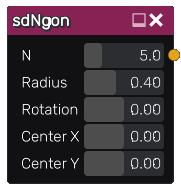

sdNGon node
..............

The **sdNGon** node generates a signed distance image for a regular polygon.

Inputs
::::::

The **sdNGon** node does not accept any input.

Outputs
:::::::

The **sdNGon** node generates a signed distance function for a regular polygon.

Parameters
::::::::::

The **sdNGon** node accepts the following parameters:

* the number of sides of the n-gon
* the size
* the rotation angle
* the position of the center

Example images
::::::::::::::

.. image:: images/node_sdngon_sample.png
	:align: center
