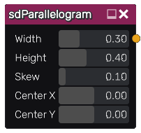

sdParallelogram node
....................

The **sdParallelogram** node generates a signed distance image for a parallelogram.

Inputs
::::::

The **sdParallelogram** node does not accept any input.

Outputs
:::::::

The **sdParallelogram** node generates a signed distance function for a parallelogram.

Parameters
::::::::::

The **sdParallelogram** node accepts the following parameters:

* **Width** of the parallelogram.

* **Height** of the parallelogram.

* **Skew** of the parallelogram.

* The position of the center along X and Y axis.

Example images
::::::::::::::

