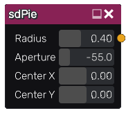

sdPie node
..........

The **sdPie** node generates a signed distance image for a pie.

Inputs
::::::

The **sdPie** node does not accept any input.

Outputs
:::::::

The **sdPie** node generates a signed distance function for a pie.

Parameters
::::::::::

The **sdPie** node accepts the following parameters:

* **Radius** of the pie.

* **Aperture** of the sector of the pie.

* Position of the center along the X and Y axis.

Example images
::::::::::::::

