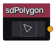

sdPolygon node
..............

The **sdPolygon** node generates a signed distance image for a polygon.

Inputs
::::::

The **sdPolygon** node does not accept any input.

Outputs
:::::::

The **sdPolygon** node generates a signed distance function for a polygon.

Parameters
::::::::::

The **sdPolygon** node accepts the polygon definition as parameter.

Example images
::::::::::::::

