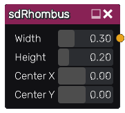

sdRhombus node
..............

The **sdRhombus** node generates a signed distance image for a rhombus.

Inputs
::::::

The **sdRhombus** node does not accept any input.

Outputs
:::::::

The **sdRhombus** node generates a signed distance function for an axis aligned rhombus.

Parameters
::::::::::

The **sdRhombus** node accepts the following parameters:

* its *width* and *height*
* the *X and Y coordinates of opposite of its center*

Example images
::::::::::::::

