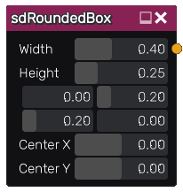

sdRoundedBox node
.................

The **sdRoundedBox** node generates a signed distance image for a rounded box.

Inputs
::::::

The **sdRoundedBox** node does not accept any input.

Outputs
:::::::

The **sdRoundedBox** node generates a signed distance function for a rounded box.

Parameters
::::::::::

The **sdRoundedBox** node accepts the following parameters:

* **Width** of the rounded box.

* **Height** of the rounded box.

* **Bottom Left** corner radius of the rounded box.

* **Top Right** corner radius of the rounded box.

* **Bottom Left** corner radius of the rounded box.

* **Top Left** corner radius of the rounded box.

* Position of the center along X and Y axis

Example images
::::::::::::::

