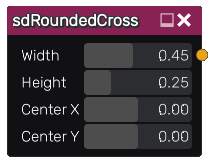

sdRoundedCross node
...................

The **sdRoundedCross** node generates a signed distance image for a rounded cross.

Inputs
::::::

The **sdRoundedCross** node does not accept any input.

Outputs
:::::::

The **sdRoundedCross** node generates a signed distance function for a rounded cross.

Parameters
::::::::::

The **sdRoundedCross** node accepts the following parameters:

* **Height** of the rounded cross.

* **Width** of the rounded cross.

* Position of the center along X and Y axis.

Example images
::::::::::::::

