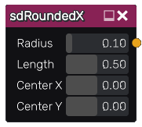

sdRoundedX node
...............

The **sdRoundedX** node generates a signed distance image for a rounded X.

Inputs
::::::

The **sdRoundedX** node does not accept any input.

Outputs
:::::::

The **sdRoundedX** node generates a signed distance function for a rounded X.

Parameters
::::::::::

The **sdRoundedX** node accepts the following parameters:

* **Radius** of the rounded X.

* **Length** of the rounded X.

* The position of the center along X and Y axis.

Example images
::::::::::::::

