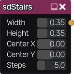

sdStairs node
~~~~~~~~~~~~~

The **sdStairs** node generates a signed distance image for a staircase.

Inputs
++++++

The **sdStairs** node does not accept any input.

Outputs
+++++++

The **sdStairs** node generates a signed distance function for a staircase.

Parameters
++++++++++

The **sdStairs** node accepts the following parameters:

* **Width** of the staircase

* **Height** of the staircase

* Position of the center along X and Y axis.

* **Steps** of the staircase

Example images
++++++++++++++

