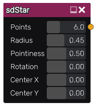

sdStar node
...........

The **sdStar** node generates a signed distance image for a regular star.

Inputs
::::::

The **sdStar** node does not accept any input.

Outputs
:::::::

The **sdStar** node generates a signed distance function for a regular star.

Parameters
::::::::::

The **sdStar** node accepts the following parameters:

* **Radius** of the star.

* **Inner Radius** of the star.

* **Count** of the sides for the star.

* Position of the center along the X and Y axis.

Example images
::::::::::::::

