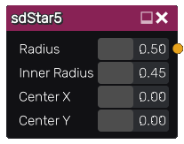

sdStar5 node
............

The **sdStar5** node generates a signed distance image for a 5-point star.

Inputs
::::::

The **sdStar5** node does not accept any input.

Outputs
:::::::

The **sdStar5** node generates a signed distance function for a 5-point star.

Parameters
::::::::::

The **sdStar5** node accepts the following parameters:

* **Radius** of the 5-point star

* **Inner Radius** of the 5-point star.

* the position of the center along X and Y axis.

Example images
::::::::::::::

