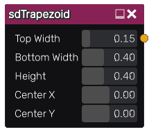

sdTrapezoid node
................

The **sdTrapezoid** node generates a signed distance image for a trapezoid.

Inputs
::::::

The **sdTrapezoid** node does not accept any input.

Outputs
:::::::

The **sdTrapezoid** node generates a signed distance function for a trapezoid.

Parameters
::::::::::

The **sdTrapezoid** node accepts the following parameters:

* **Top Width** of the trapezoid.

* **Bottom Width** of the trapezoid.

* **Height** of the trapezoid.

* Position of the center along the X and Y axis.

Example images
::::::::::::::

