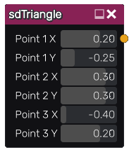

sdTriangle node
...............

The **sdTriangle** node generates a signed distance image for an arbitrary triangle.

Inputs
::::::

The **sdTriangle** node does not accept any input.

Outputs
:::::::

The **sdTriangle** node generates a signed distance function for an arbitrary triangle.

Parameters
::::::::::

The **sdTriangle** node accepts the following parameters:

* Position on the X axis of the first point of the triangle.

* Position on the Y axis of the first point of the triangle.

* Position on the X axis of the second point of the triangle.

* Position on the Y axis of the second point of the triangle.

* Position on the X axis of the third point of the triangle.

* Position on the Y axis of the third point of the triangle.

Example images
::::::::::::::

