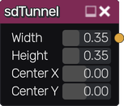

sdTunnel node
~~~~~~~~~~~~~

The **sdTunnel** node generates a signed distance image for a tunnel.

Inputs
++++++

The **sdTunnel** node does not accept any input.

Outputs
+++++++

The **sdTunnel** node generates a signed distance function for a tunnel.

Parameters
++++++++++

The **sdTunnel** node accepts the following parameters:

* **Width** of the tunnel

* **Height** of the tunnel

* Position of the center along X and Y axis.

Example images
++++++++++++++

