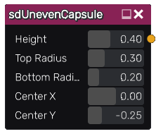

sdUnevenCapsule node
....................

The **sdUnevenCapsule** node generates a signed distance image for an uneven capsule.

Inputs
::::::

The **sdUnevenCapsule** node does not accept any input.

Outputs
:::::::

The **sdUnevenCapsule** node generates a signed distance function for an uneven capsule.

Parameters
::::::::::

The **sdUnevenCapsule** node accepts the following parameters:

* **Height** of the uneven capsule.

* **Top Radius** of the uneven capule.

* **Bottom Radius** of the uneven capsule.

* Position of the center along the X and Y axis.

Example images
::::::::::::::

