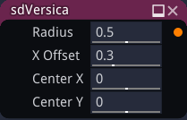
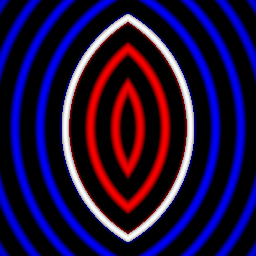

sdVersica node
..............

The **sdVersica** node generates a signed distance image for a versica.

Inputs
::::::

The **sdVersica** node does not accept any input.

Outputs
:::::::

The **sdVersica** node generates a signed distance function for a versica.

Parameters
::::::::::

The **sdVersica** node accepts the following parameters:

* **Radius** of the versica.

* **X offset** of distance between the disks.

* The position of the center along the X and Y axis.

Example images
::::::::::::::

