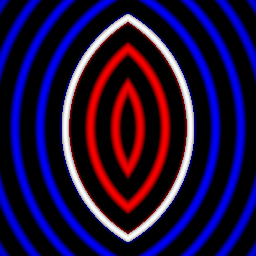

sdVesica node
.............

The **sdVesica** node generates a signed distance image for a vesica.

.. image:: images/node_simple_sdf_shapes_sdversica.png
	:align: center

Inputs
::::::

The **sdVesica** node does not accept any input.

Outputs
:::::::

The **sdVesica** node generates a signed distance function for a vesica.

Parameters
::::::::::

The **sdVesica** node accepts the following parameters:

* **Radius** of the vesica.

* **X offset** of distance between the disks.

* The position of the center along the X and Y axis.

Example images
::::::::::::::

