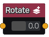

Rotate node
.............

The **Rotate** node generates a signed distance image obtained by rotating its input.

Inputs
::::::

The **Rotate** node accepts a single input in signed distance function format.

Outputs
:::::::

The **Rotate** node generates a signed distance function of the
rotated shape.

Parameters
::::::::::

The **Rotate** node accepts accepts *rotation angle* as parameter.
