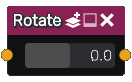

Rotate node
.............

The **Rotate** node is variadic and generates signed distance images obtained by rotating its inputs.

Inputs
::::::

The **Rotate** node accepts one or more inputs in signed distance function format.

Outputs
:::::::

The **Rotate** node generates a signed distance functions of the
rotated shapes.

Parameters
::::::::::

The **Rotate** node accepts *rotation angle* as parameter.
