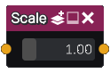

Scale node
.............

The **Scale** node is variadic and generates signed distance images obtained by scaling its inputs.

Inputs
::::::

The **Scale** node accepts one or more inputs in signed distance function format.

Outputs
:::::::

The **Scale** node generates signed distance functions of the
scaled shapes.

Parameters
::::::::::

The **Scale** node accepts *scale factor* as parameter.
