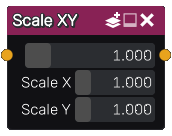

Scale XY node
.............

The **Scale XY** node generates a signed distance image obtained by scaling its input in a non uniform way.
The result shape is no longer a correct signed distance function, but can be used for many operations like ray marching.

Inputs
::::::

The **Scale XY** node accepts a single input in signed distance function format.

Outputs
:::::::

The **Scale XY** node generates a signed distance function of the scaled shape.

Parameters
::::::::::

The **Scale XY** node has three parameters:

* The *Scale* used as a uniform scale factor.

* The *Scale X* parameter defines the scale ratio along the X axis.

* The *Scale Y* parameter defines the scale ratio along the Y axis.
