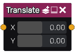

Translate node
..............

The **Translate** node is variadic and generates signed distance images obtained by translating its inputs.

Inputs
::::::

The **Translate** node accepts one or more inputs in signed distance function format.

Outputs
:::::::

The **Translate** node generates signed distance functions of the
translated shapes.

Parameters
::::::::::

The **Translate** node accepts *X and Y offsets* of the translation as parameters.
