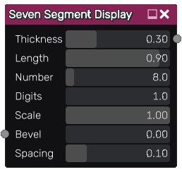

Seven segment display node
~~~~~~~~~~~~~~~~~~~~~~~~~~

The **Seven Segment Display** node outputs a seven segment display with variable weight(segment length/thickness)

Inputs
++++++

The **Seven Segment Display** node accepts an optional bevel map, which the parameter is multiplied by the map value.

Outputs
+++++++

The **Seven Segment Display** outputs a greyscale texture.

Parameters
++++++++++

The **Seven Segment Display** node accepts the following parameters:

* The *Thickness* parameter controls the thickness of the segments.

* The *Length* parameter controls the length of the segments.

* The *Number* parameter specifies the number on the display.

* The *Digits* parameter specifies the minimum number of digits on the display.

* The *Scale* parameter controls the scale of the output texture.

* the *Bevel* parameter controls the width of the edge of each segment.

* the *Spacing* parameter controls the spacing between digits on the display.

Example images
++++++++++++++

