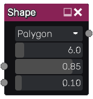
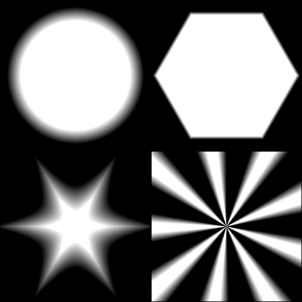

Shape node
~~~~~~~~~~

The **Shape** node outputs a simple greyscale shape.

Inputs
++++++

The shape node accepts 2 optional greyscale input maps for the shape size and
edge width (the corresponding parameter is multiplied by the map value).

Outputs
+++++++

The shape node provides an output that generates greyscale image showing the
selected white shape on a black background.

Parameters
++++++++++

The **Shape** node has the following parameters:

* the shape type: Circle, Polygon, Star, Curved Star or Rays
* the edge, corners or rays count
* the shape size
* the size of the gradient at the edge of the shape

Example images
++++++++++++++

