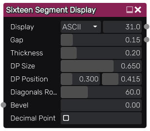

Sixteen Segment Display node
~~~~~~~~~~~~~~~~~~~~~~~~~~~~

The **Sixteen Segment Display** node outputs a sixteen segment display with variable weight

Inputs
++++++

The **Sixteen Segment Display** node accepts an optional bevel map, which the parameter is multiplied by the map value.

Outputs
+++++++

The **Sixteen Segment Display** node outputs two grayscale images, the generated display and a hard mask for all segments

Parameters
++++++++++

The **Sixteen Segment Display** node accepts the following parameters:

* The *Display Mode* parameter how the *Character Code* is handled. *ASCII* handles 
  the *Character Code* as an ASCII code (32-115), where 31 displays all segments. *Custom* interprets the
  *Character Code* as an unsigned 16-bit integer(0-65535), where bit positions are used to determine which segments to be turned on.

* The *Character Code* parameter specifies the character to display, based on the *Display Mode*

* The *Gap* parameter specifies the distance between each segment on the display.

* The *Thickness* parameter controls the thickness of the segments.

* The *DP Size* parameter controls the size of the decimal point on the display.

* The *DP Position* parameter specifies the position of the decimal point on the display.

* The *Diagonals Rotation* parameter controls the rotation of the four diagonal segments on the display.

* The *Bevel* parameter controls the width of the edge of each segment.

* The *Decimal Point* parameter toggles the decimal point on the display on or off, when the *Display Mode*
  is set to *Custom*

Example images
++++++++++++++

